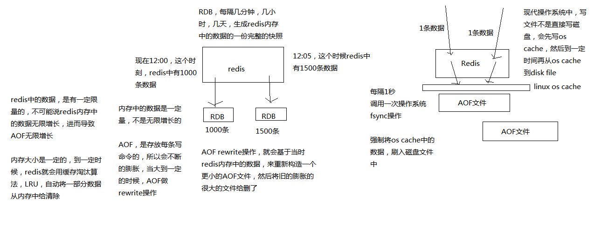

# RDB和AOF两种持久化机制的介绍

RDB持久化机制，对redis中的数据执行周期性的持久化

AOF机制对每条写入命令作为日志，以append-only的模式写入一个日志文件中，在redis重启的时候，可以通过回放AOF日志中的写入指令来重新构建整个数据集

如果我们想要redis仅仅作为纯内存的缓存来用，那么可以禁止RDB和AOF所有的持久化机制

通过RDB或AOF，都可以将redis内存中的数据给持久化到磁盘上面来，然后可以将这些数据备份到别的地方去，比如说阿里云，云服务

如果redis挂了，服务器上的内存和磁盘上的数据都丢了，可以从云服务上拷贝回来之前的数据，放到指定的目录中，然后重新启动redis，redis就会自动根据持久化数据文件中的数据，去恢复内存中的数据，继续对外提供服务

如果同时使用RDB和AOF两种持久化机制，那么在redis重启的时候，会使用AOF来重新构建数据，因为AOF中的数据更加完整

AOF rewrite原理剖析
