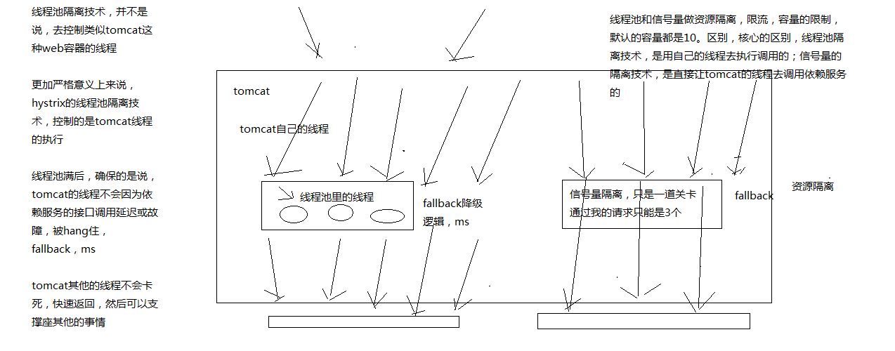

# 线程池隔离技术与信号量隔离技术的区别

hystrix里面，核心的一项功能，其实就是所谓的资源隔离，要解决的最最核心的问题，就是将多个依赖服务的调用分别隔离到各自自己的资源池内

避免说对某一个依赖服务的调用，因为依赖服务的接口调用的延迟或者失败，导致服务所有的线程资源全部耗费在这个服务的接口调用上

一旦说某个服务的线程资源全部耗尽的话，可能就导致服务就会崩溃，甚至说这种故障会不断蔓延

hystrix，资源隔离，两种技术，线程池的资源隔离，信号量的资源隔离

信号量，semaphore

信号量跟线程池，两种资源隔离的技术，区别到底在哪儿呢？


线程池隔离和信号量隔离的原理以及区别

# 线程池隔离技术和信号量隔离技术，分别在什么样的场景下去使用呢？？

线程池：适合绝大多数的场景，99%的，线程池，对依赖服务的网络请求的调用和访问，timeout这种问题

信号量：适合，你的访问不是对外部依赖的访问，而是对内部的一些比较复杂的业务逻辑的访问，但是像这种访问，系统内部的代码，其实不涉及任何的网络请求，那么只要做信号量的普通限流就可以了，因为不需要去捕获timeout类似的问题，算法+数据结构的效率不是太高，并发量突然太高，因为这里稍微耗时一些，导致很多线程卡在这里的话，不太好，所以进行一个基本的资源隔离和访问，避免内部复杂的低效率的代码，导致大量的线程被hang住

# 在代码中加入从本地内存获取地理位置数据的逻辑

业务背景里面， 比较适合信号量的是什么场景呢？

比如说，我们一般来说，缓存服务，可能会将部分量特别少，访问又特别频繁的一些数据，放在自己的纯内存中

一般我们在获取到商品数据之后，都要去获取商品是属于哪个地理位置，省，市，卖家的，可能在自己的纯内存中，比如就一个Map去获取

对于这种直接访问本地内存的逻辑，比较适合用信号量做一下简单的隔离

优点在于，不用自己管理线程池拉，不用care timeout超时了，信号量做隔离的话，性能会相对来说高一些

# 采用信号量技术对地理位置获取逻辑进行资源隔离与限流

```
super(Setter.withGroupKey(HystrixCommandGroupKey.Factory.asKey("ExampleGroup"))
        .andCommandPropertiesDefaults(HystrixCommandProperties.Setter()
               .withExecutionIsolationStrategy(ExecutionIsolationStrategy.SEMAPHORE)));
```
