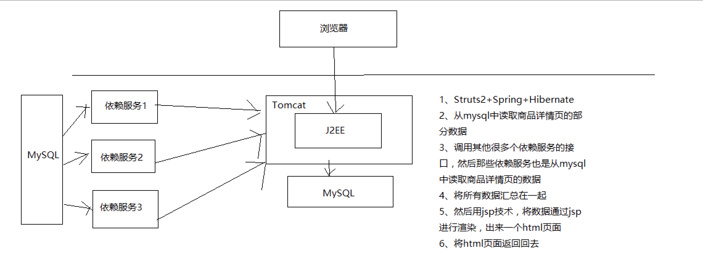
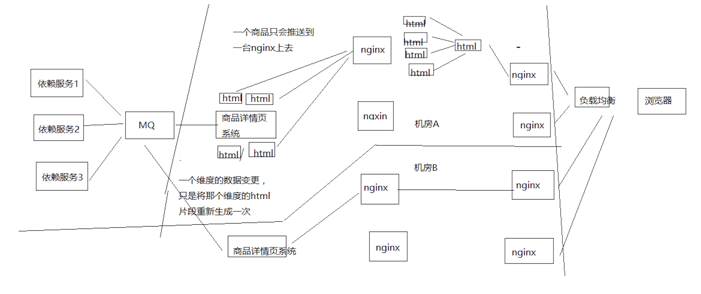
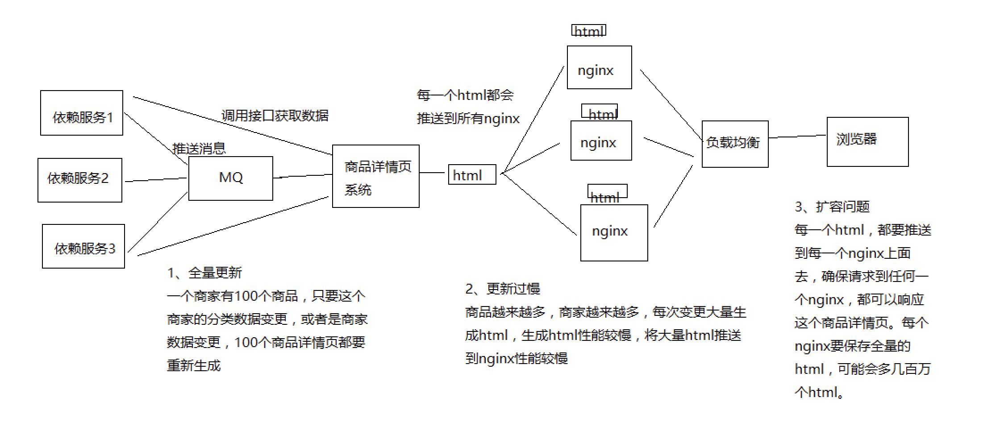
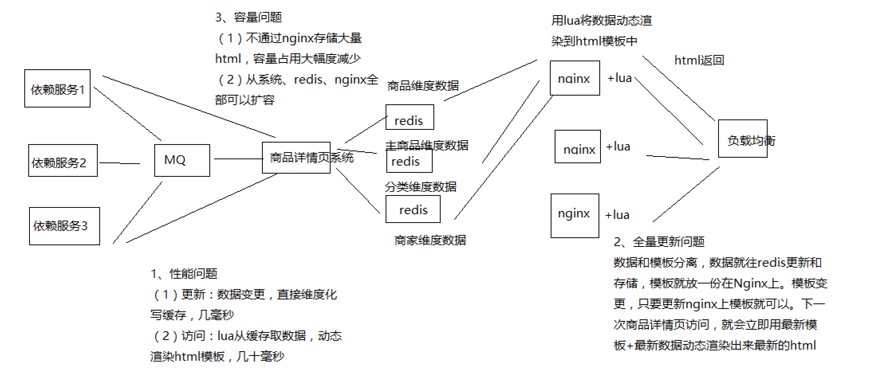

商品详情页系统架构演进历程

# 第一个版本
## 架构设计
    
J2EE+Tomcat+MySQL
动态页面，每次请求都要调用多个依赖服务的接口，从数据库里查询数据，然后通过类似JSP的技术渲染到HTML模板中，返回最终HTML页面
## 架构缺陷
每次请求都是要访问数据库的，性能肯定很差
每次请求都要调用大量的依赖服务，依赖服务不稳定导致商品详情页展示的性能经常抖动
    

第一个版本的架构

# 第二个版本
		架构设计
			页面静态化技术
			通过MQ得到商品详情页涉及到的数据的变更消息
			通过Java Worker服务全量调用所有的依赖服务的接口，查询数据库，获取到构成一个商品详情页的完整数据，并通过velocity等模板技术生成静态HTML
			将静态HTML页面通过rsync工具直接推送到多台nginx服务器上，每台nginx服务器上都有全量的HTML静态页面
			nginx对商品详情页的访问请求直接返回本地的静态HTML页面
			在nginx服务器前加一层负载均衡设备，请求打到任何一台应用nginx服务器上，都有全量的HTML静态页面可以返回
		架构缺陷
			全量更新问题
				如果某一个商品分类、商家等信息变更了
				那么那个分类、店铺、商家下面所有的商品详情页都需要重新生成静态HTML页面
			更新速度过慢问题
				分类、店铺、商家、商品越来越多
				重新生成HTML的负载越来越高，rsync全量同步所有nginx的负载也越来越高
				从数据变更到生成静态HTML，再到全量同步到所有nginx，时间越来越慢
			扩容问题
				因为每个商品详情页都要全量同步到所有的nginx上，导致系统无法扩容，无法增加系统容量
		架构优化
			解决全量更新问题
				每次Java Worker收到某个维度的变更消息，不是拉去全量维度并生成完整HTML，而是按照维度拆分，生成一个变化维度的HTML片段
				nginx对多个HTML片段通过SSI合并html片段然后输出一个完整的html
			解决扩容问题
				每个商品详情页不是全量同步到所有的nginx
				而是根据商品id路由到某一台nginx上，同时接入层nginx按照相同的逻辑路由请求
			更新速度过慢问题
				增加更多机器资源
				多机房部署，每个机房部署一套Java Worker+应用Nginx，所有机房用一套负载均衡设备，在每个机房内部完成全流程，不跨机房
		架构优化后的缺陷
			更新速度还是不够快的问题
				商品的每个维度都有一个HTML片段，rsync推送大量的HTML片段，负载太高，性能较差
				Nginx基于机械硬盘进行SSI合并，性能太差
			还是存在全量更新的问题
				虽然解决了分类、商家、店铺维度的变更，只要增量重新生产较小的HTML片段即可，不用全量重新生成关联的所有商品详情页的HTML
				但是如果某个页面模板变更，或者新加入一个页面模板，还是会导致几亿个商品的HTML片段都要重新生成和rsync，要几天时间才能完成，无法响应需求
			还是存在容量问题
				nginx存储有限，不能无限存储几亿，以及增长的商品详情页的HTML文件
				如果nginx存储达到极限，需要删除部分商品详情页的HTML文件，改成nginx找不到HTML，则调用后端接口，回到动态页面的架构
				动态页面架构在高并发访问的情况下，会对依赖系统造成过大的压力，几乎扛不住

第二个版本的架构

第2个版本的架构问题

# 第三个版本
		需要支持的需求
			迅速响应各种页面模板的改版和个性化需求的新模板的加入
			页面模块化，页面中的某个区域变化，只要更新这个区域中的数据即可
			支持高性能访问
			支持水平扩容的伸缩性架构
		架构设计
			系统架构设计
				依赖服务有数据变更发送消息到MQ
				数据异构Worker服务监听MQ中的变更消息，调用依赖服务的接口，仅仅拉取有变更的数据即可，然后将数据存储到redis中
				数据异构Worker存储到redis中的，都是原子未加工数据，包括商品基本信息、商品扩展属性、商品其他信息、商品规格参数、商品分类、商家信息
				数据异构Worker发送消息到MQ，数据聚合Worker监听到MQ消息
				数据聚合Worker将原子数据从redis中取出，按照维度聚合后存储到redis中，包括三个维度
					基本信息维度：基本信息、扩展属性
					商品介绍：PC版、移动版
					其他信息：商品分类、商家信息
				nginx+lua，lua从redis读取商品各个维度的数据，通过nginx动态渲染到html模板中，然后输出最终的html
			如何解决所有的问题
				更新问题：不再是生成和推送html片段了，不再需要合成html，直接数据更新到redis，然后走动态渲染，性能大大提升
				全量更新问题：数据和模板分离，数据更新呢就更新数据，模板更新直接推送模板到nginx，不需要重新生成所有html，直接走动态渲染
				容量问题：不需要依赖nginx所在机器的磁盘空间存储大量的html，将数据放redis，html就存放模板，大大减少空间占用，而且redis集群可扩容

第3个版本的架构
